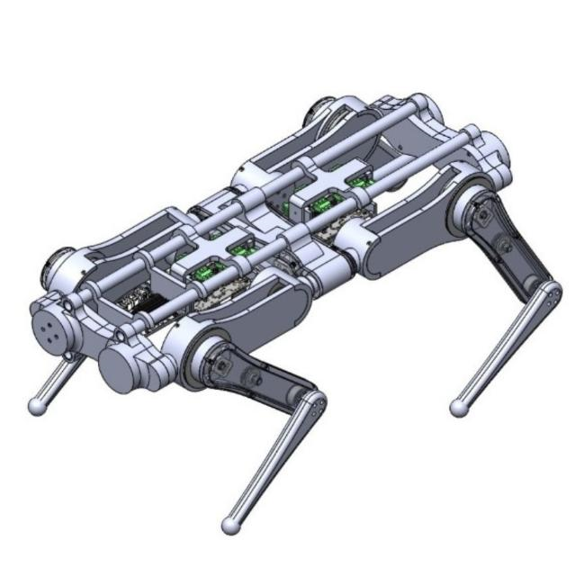

# ABSTRACT

The idea behind the project was to redesign and create a new leg design for Quadruped robots, which are robots designed with four legs and have several practical applications. They can navigate difficult terrain and environments that are inaccessible to wheeled or bipedal robots, making them useful for tasks such as search and rescue operations or exploration of rough terrain. Quadruped robots can also be used for inspection and maintenance of industrial equipment and infrastructure, as well as for agricultural applications such as herding livestock and monitoring crops. In addition, the stability provided by four legs makes Quadruped robots well-suited for tasks that require high precision and stability, such as carrying and manipulating heavy objects.

---

**Work Done**
---
Found the stable workspace of a Quadruped Robot using Kinematic Analysis
* Designed a CAD model using SolidWorks
* Redesigned the legs in RRR configuration
* Conducted Inverse Kinematic Analysis to obtain the Transformation Matrix
* Obtained the Stable Workspace of the Robot by plotting the area covered by the centroid of the Next Swing Leg and the Support Polygon using MATLAB
* Incorporated pitch, yaw and roll, as well as various gaits, including trot, canter and pace

---

# CONCLUSION

The simulations showed the final output of the project depicting the capabilities of the robot. The robot was fully capable of dropping down to a much lower height as the limbs are out of plane of the robot. This increased the mobility of the robot in cramped and low lying areas. It can also be noted that the robot was able to maintain the same functionality as before without the increase in any additional constraints due to the redesigning of the legs.
